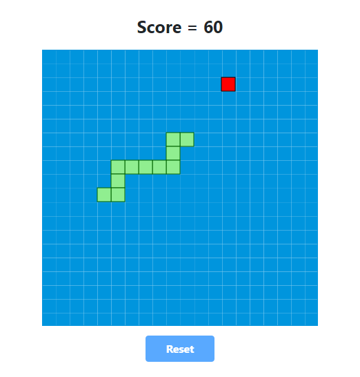

# Snake Game

Classic snake game built in Vanilla JavaScript

## Description

This is the first project I made as a final project for my first javascript course. It was challenging at first, but at the end I was confident with the code.

## How to play

You have to clone or download the project and then open the `index.html` file to play the Snake Game. 

## Author
- Itziar Urbieta
